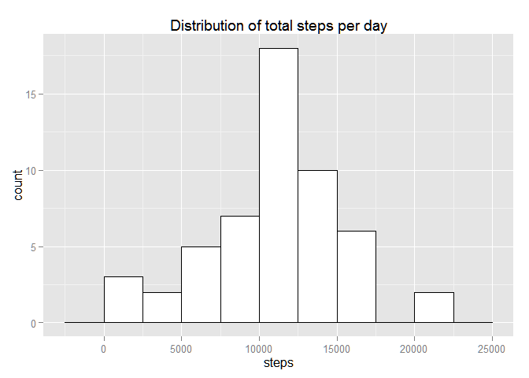
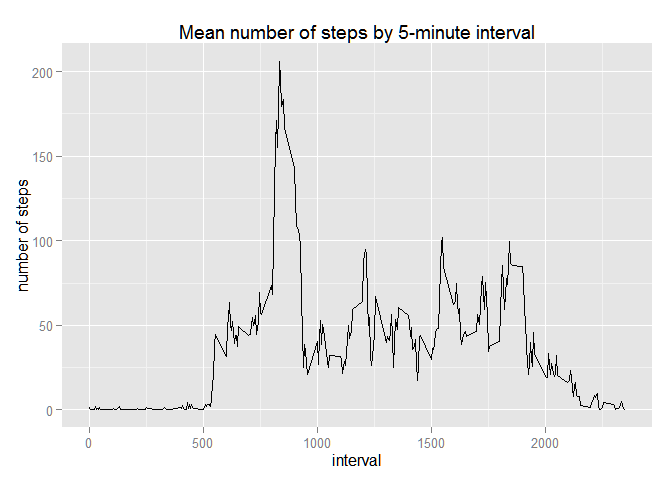
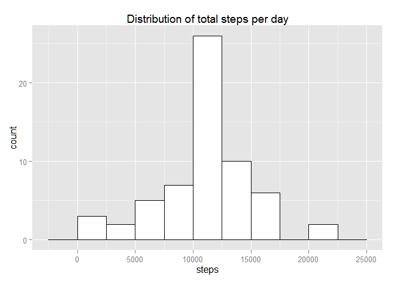
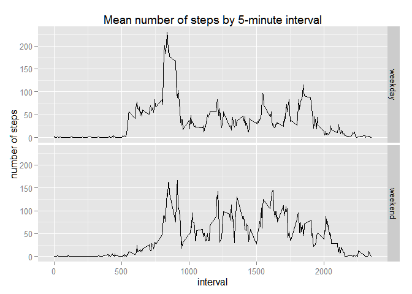

# Reproducible Research: Peer Assessment 1

This document describes the steps for processing data from a personal activity monitoring device. This device collects data at 5 minute intervals through out the day. The data consists of two months of data from an anonymous individual collected during the months of October and November, 2012 and include the number of steps taken in 5 minute intervals each day.

## Loading and preprocessing the data

The original dataset is available in a zip compressed file, named *activity.zip*, which contains the comma separated value file named *activity.csv*. The first step is to read the data in this file. Given that the zip file is in the current working directory, this can be performed by the following R statement:


```r
actdata <- read.csv(unz("activity.zip","activity.csv"))
```

Some properties of this dataset can be extracted by:

```r
nobs <- nrow(actdata)
nvar <- ncol(actdata)
varnames <- names(actdata[1])
i <- 2;
while(i<nvar) { 
        varnames <- paste(varnames,names(actdata[i]),sep=", ")
        i<-i+1
}
varnames <- paste(varnames,names(actdata[nvar]), sep=", and ")
```
From these statements, it can be observed that this dataset has 17568 observations of 3 variables: steps, date, and interval. The dataset summary is given by:

```r
summary(actdata)
```

```
##      steps                date          interval     
##  Min.   :  0.00   2012-10-01:  288   Min.   :   0.0  
##  1st Qu.:  0.00   2012-10-02:  288   1st Qu.: 588.8  
##  Median :  0.00   2012-10-03:  288   Median :1177.5  
##  Mean   : 37.38   2012-10-04:  288   Mean   :1177.5  
##  3rd Qu.: 12.00   2012-10-05:  288   3rd Qu.:1766.2  
##  Max.   :806.00   2012-10-06:  288   Max.   :2355.0  
##  NA's   :2304     (Other)   :15840
```

In the following parts, the package *dplyr* will be used to transform the dataset and the *ggplot2* for the graphics. Thus, these packages should be loaded:

```r
library(dplyr)
```

```
## 
## Attaching package: 'dplyr'
## 
## The following object is masked from 'package:stats':
## 
##     filter
## 
## The following objects are masked from 'package:base':
## 
##     intersect, setdiff, setequal, union
```

```r
library(ggplot2)
```

## What is mean total number of steps taken per day?

To answer this question, the first task required is to calculate the total number of steps taken per day, ignoring missing values. The first step is to create a data frame with the sum of steps grouped by day, using *dplyr*:

```r
stepday <- actdata %>% 
        na.omit() %>%
        group_by(date) %>%
        summarise(totsteps=sum(steps))
```

A histogram of the total number of steps taken each day can now be produced using *ggplot2*: 

```r
ggplot(stepday, aes(x=totsteps)) + 
        geom_histogram(binwidth=2500,colour="black", fill="white") +
        ggtitle("Distribution of total steps per day") +
        xlab("steps")
```

 

To calculate the mean and median of the total number of steps taken per day, the following R statements can be used:

```r
steps_mean <- mean(stepday$totsteps)
steps_median <- median(stepday$totsteps)
```
Thus, the mean value for the total number of steps per day is 10766.2 and the median value is 10765.

## What is the average daily activity pattern?

In order to answer this question, it is necessary to group the observations by interval, aggregating the number of steps by the mean value. Using *dplyr*, this can be performed by applying the following functions:

```r
stepint <- actdata %>%
        na.omit() %>%
        group_by(interval) %>%
        summarise(meansteps=mean(steps))
```

To make a time series plot of the 5-minute interval (x-axis) and the average number of steps taken, averaged across all days (y-axis), the following *ggplot2* statements can be used:

```r
ggplot(data=stepint, aes(x=interval, y=meansteps, group=1)) +
        geom_line() +
        ggtitle("Mean number of steps by 5-minute interval") +
        xlab("interval") +
        ylab("number of steps")
```

 

The 5-minute interval, on average across all the days in the dataset, that contains the maximum number of steps (which is 206.2), can be found by using the *which.max* statement:

```r
maxinterval <- stepint[which.max(stepint$meanstep),]$interval
maxhour <- maxinterval%/%100
maxminute <- maxinterval%%100
```
In this case, this interval is 835, that is, the interval starting at 8 hours and 35 minutes.

## Imputing missing values

It should be observed that there are a number of days/intervals where there are missing values (coded as NA). The presence of missing days may introduce bias into some calculations or summaries of the data.

In the original dataset, the total number of missing values in the dataset (i.e. the total number of rows with NAs) can be found using:

```r
rows_na <- sum(is.na(actdata$steps))
```
In this case, there are 2304 rows whose number of steps is missing.

A simple strategy for filling in all of the missing values in the dataset is to replace the NA by the daily mean value for the corresponding 5-minute interval, already computed and stored in the *stepint* dataset. First, it is necessary to verify all positions that are NA in the original activity dataset:

```r
index <- which(is.na(actdata$steps))
```
The corresponding indices in the *stepint* dataset, in periods of 288 intervals, is given by:

```r
avgindex <- index%%288
avgindex[avgindex==0] <- 288
```
Now, the dataset replacing the missing values by the respective averages can be computed as:

```r
newactdata <- actdata 
newactdata[index,]$steps <- stepint[avgindex,]$meansteps
```
Now, *newactdata* is a dataset that is equal to the original dataset but with the missing data filled in. For this new data set, the total number of steps per day is given by

```r
newstepday <- newactdata %>% 
        group_by(date) %>%
        summarise(totsteps=sum(steps))
```
For this new data set, the histogram of the total number of steps taken each day, using *ggplot2*, can be plotted by:

```r
ggplot(newstepday, aes(x=totsteps)) + 
        geom_histogram(binwidth=2500,colour="black", fill="white") +
        ggtitle("Distribution of total steps per day") +
        xlab("steps")
```

 

The mean and median of the total number of steps taken per day for the new data set are:

```r
new_steps_mean <- mean(newstepday$totsteps)
new_steps_median <- median(newstepday$totsteps)
```
Thus, for this dataset with imouted missing values, the mean value for the total number of steps per day is 10766.2 (which is 0 steps larger than the previous estimate, computed in the first part of this document) and the median value is 10766.2 (1.2 steps larger than the previous value).

Therefore, applying this strategy for imputing missing data on the estimates of the total daily number of steps has a minimal impact on the values of the mean and of the median, even though there is a difference in the two distributions, as can be observed by comparing the y-axis of both histograms, since the bin containing the mean value becames higher.


## Are there differences in activity patterns between weekdays and weekends?

To answer this question, it is necessary to create a new factor variable in the dataset with two levels – “weekday” and “weekend”, indicating whether a given date is a weekday or weekend day. This can be achieved by adding a new column in the data frame (without missing values, in this case) with two possible values, depending on if the day is between Monday and Friday (wday field from POSIXlt between 1 and 5, respectively) or if it either Sunday (wday 0) or Saturday (wday 6):

```r
finalactdata <- newactdata %>%
        mutate(day = as.factor(ifelse(as.POSIXlt(as.Date(newactdata$date))$wday %in% c(1:5), "weekday", "weekend")))
```

Now, to average the number of steps by interval on these types of day:

```r
finalstepint <- finalactdata %>%
        group_by(interval,day) %>%
        summarise(meansteps=mean(steps))
```

By making a panel plot containing a time series plot of the 5-minute interval (x-axis) and the average number of steps taken, averaged across all weekday days or weekend days (y-axis), it is possible to observe if there are sensible differences in the average step patterns for these types of days:

```r
ggplot(data=finalstepint, aes(x=interval, y=meansteps, group=1)) +
        geom_line() +
        facet_grid(day ~ .) +
        ggtitle("Mean number of steps by 5-minute interval") +
        xlab("interval") +
        ylab("number of steps")
```

 

Therefore, a difference can be observed in the average number of steps by interval during weekends, with activity more evenly distributed along the middle of the day (office hours), compared to weekdays, with a peak of activity in the morning.
